Modeling and prediction for movies
================

## Setup

### Load packages

``` r
library(ggplot2)
library(dplyr)
library(statsr)
library(kableExtra)
library(GGally)
library(gridExtra)
```

### Load data

``` r
load("movies.Rdata")
```

-----

## Part 1: Data

### Introduction

This study evaluates a data set provided for Coursera which contains 651
random movies produced and released before 2016 and selected from
<a href="http://www.rottentomatoes.com/" target="_blank">Rotten
Tomatoes</a> and <a href="http://www.imdb.com/" target="_blank">IMDB</a>
websites. Both websites rate movies and provide some information about
them.

### Scope inference

This is an observational study that uses a random sampling approach to
obtain a representative sample which makes the data generalizable to
movies. Because the study does not use a random assignment that can have
an indication of association among the relationship of the variables of
interest, but not causation.

The audience score is created by volunteers who can raise a bias in the
study because probably those are people with more interest in movies and
with strong opinions and different than the overall audience.

-----

## Part 2: Research question

<span style="font-weight: bold; font-size: 16px;">Is there a
relationship between the IMDB rating and the runtime variable? Can this
relationship be affected by the movie’s genre?</span>

Maybe the IMDB rating is affected depending on how long is the movie. It
is possible that too short or too long movies have a worse rating. Maybe
the genre affects the movie’s runtime and the rating.

-----

## Part 3: Exploratory data analysis

The goal is to analyze a possible relationship between the IMDB rating
and genre and runtime variables.

Let’s start the data in genre and runtime variables.

``` r
genre <- data.frame(round(prop.table(table(movies$genre)) * 100, 2))
genre[order(genre$Freq, decreasing = T), ] %>% 
  kbl() %>% kable_styling(bootstrap_options = c("striped", "hover", "condensed", "responsive"))
```

<table class="table table-striped table-hover table-condensed table-responsive" style="margin-left: auto; margin-right: auto;">

<thead>

<tr>

<th style="text-align:left;">

</th>

<th style="text-align:left;">

Var1

</th>

<th style="text-align:right;">

Freq

</th>

</tr>

</thead>

<tbody>

<tr>

<td style="text-align:left;">

6

</td>

<td style="text-align:left;">

Drama

</td>

<td style="text-align:right;">

46.85

</td>

</tr>

<tr>

<td style="text-align:left;">

4

</td>

<td style="text-align:left;">

Comedy

</td>

<td style="text-align:right;">

13.36

</td>

</tr>

<tr>

<td style="text-align:left;">

1

</td>

<td style="text-align:left;">

Action & Adventure

</td>

<td style="text-align:right;">

9.98

</td>

</tr>

<tr>

<td style="text-align:left;">

9

</td>

<td style="text-align:left;">

Mystery & Suspense

</td>

<td style="text-align:right;">

9.06

</td>

</tr>

<tr>

<td style="text-align:left;">

5

</td>

<td style="text-align:left;">

Documentary

</td>

<td style="text-align:right;">

7.99

</td>

</tr>

<tr>

<td style="text-align:left;">

7

</td>

<td style="text-align:left;">

Horror

</td>

<td style="text-align:right;">

3.53

</td>

</tr>

<tr>

<td style="text-align:left;">

10

</td>

<td style="text-align:left;">

Other

</td>

<td style="text-align:right;">

2.46

</td>

</tr>

<tr>

<td style="text-align:left;">

3

</td>

<td style="text-align:left;">

Art House & International

</td>

<td style="text-align:right;">

2.15

</td>

</tr>

<tr>

<td style="text-align:left;">

8

</td>

<td style="text-align:left;">

Musical & Performing Arts

</td>

<td style="text-align:right;">

1.84

</td>

</tr>

<tr>

<td style="text-align:left;">

2

</td>

<td style="text-align:left;">

Animation

</td>

<td style="text-align:right;">

1.38

</td>

</tr>

<tr>

<td style="text-align:left;">

11

</td>

<td style="text-align:left;">

Science Fiction & Fantasy

</td>

<td style="text-align:right;">

1.38

</td>

</tr>

</tbody>

</table>

``` r
par(mar = c(11,4,4,2) + 0.1)
barplot(height = genre$Freq, names = genre$Var1,
        col = palette.colors(nrow(genre)),
        main = "Lower Class", las = 2)
```

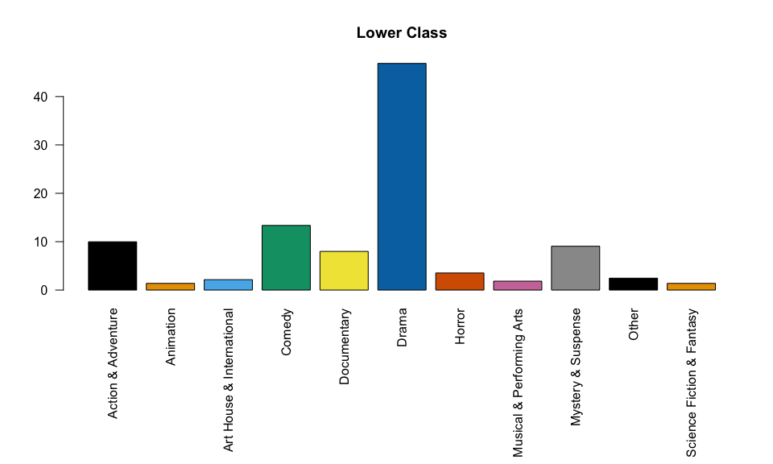<!-- -->

The genre variable has `Drama` with more than 46% of the movies.
<br/><br/><br/><br/>

``` r
summary(movies$runtime)
```

    ##    Min. 1st Qu.  Median    Mean 3rd Qu.    Max.    NA's 
    ##    39.0    92.0   103.0   105.8   115.8   267.0       1

``` r
hist(movies$runtime, main = 'Histogram of Runtime', xlab = 'Runtime')
```

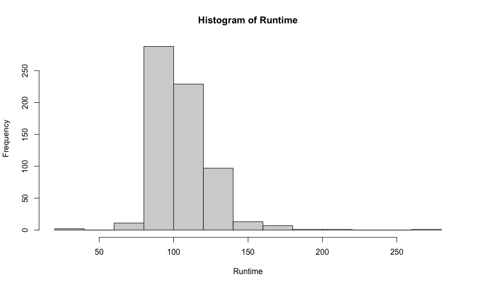<!-- -->

The `Runtime` variable is moderately right-skewed and has a null value.
The values are concentrating around 100 minutes for the majority of the
movies. <br/><br/><br/><br/>

``` r
summary(movies$imdb_rating)
```

    ##    Min. 1st Qu.  Median    Mean 3rd Qu.    Max. 
    ##   1.900   5.900   6.600   6.493   7.300   9.000

``` r
hist(movies$imdb_rating, main = 'Histogram of IMDB Rating', xlab = 'IMDB Rating')
```

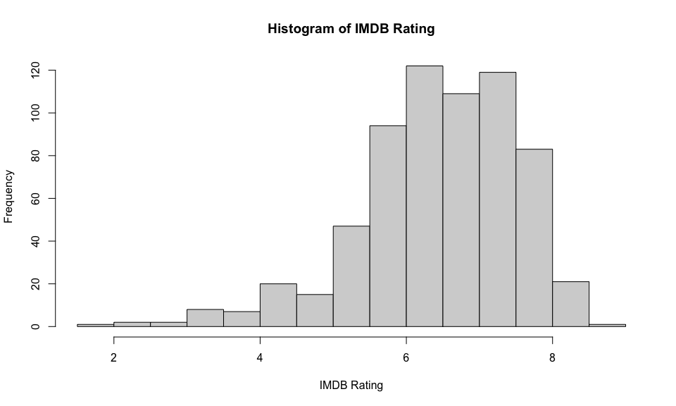<!-- -->

The `IMDB rating` variable is left-skewed. The values are concentrating
around 6.5 rates for the majority of the movies and only 25% of the
movies have less than 5.9 as rate. It means that the big majority of
movies have a good rate or at least better than average.
<br/><br/><br/><br/>

``` r
df <- movies %>% filter(!is.na(runtime)) %>% select('imdb_rating', 'runtime')
ggpairs(df)
```

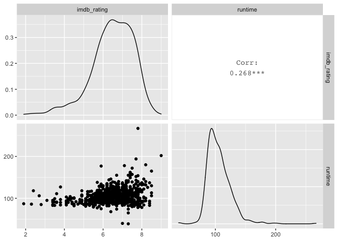<!-- -->

``` r
ggplot(data = df, aes (x = runtime, y = imdb_rating)) + 
  geom_jitter(color = 'darkblue') + 
  geom_smooth(method = 'lm', formula = y~x, color = 'red') +
  ylab("IMDB Rating") +
  xlab("Runtime") +
  labs(title = "Scatter Plot of IMDB Rating vs Runtime" )
```

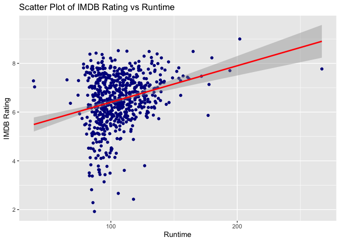<!-- -->

The correlation between `IMDB rating` and `Runtime` is weak. It means a
movie’s `runtime` does not strongly affect its `IMDB rating`.
<br/><br/><br/><br/>

``` r
graphs <- list()
pos <- 1
genres <- unique(movies$genre)
for (g in genres) {
  df <- movies %>% filter(!is.na(runtime) & genre == g) %>% select('imdb_rating', 'runtime')
  correlation <- round(cor(df)[1, 2], 2)
  
  graphs[[pos]] <- ggplot(data = df, aes (x = runtime, y = imdb_rating)) + 
    geom_jitter(color = 'darkblue') + 
    geom_smooth(method = 'lm', formula = y~x, color = 'red') +
    ylab('IMDB Rating') +
    xlab('Runtime') +
    labs(title = paste(g, '-', 'Correlation:', correlation)) +
    theme(plot.title = element_text(hjust = 0.5))
  
  pos <- pos + 1
}

grid.arrange(grobs = graphs,
            ncol = 2, nrow = round(length(graphs) / 2))
```

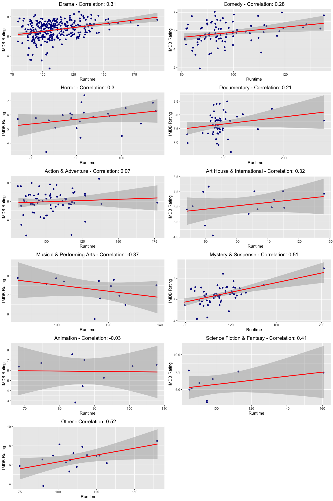<!-- -->

Dividing the movies by genre is possible to see that only a few have a
strong relationship between the `IMDB rating` and the `Runtime`. Those
are `Mystery & Suspense` and `Other` and probably their stronger
correlation is explained by outliers.

-----

## Part 4: Modeling

In this step, we will predict the `IMDB rating` using multiple linear
regression and comparing with the actor, actress, director or the move
won any Oscar. The idea is to verify if have any relation with win an
Oscar increases the movie’s rating. Beyond that, we can simulate if the
`IMDB` website always has a delay rating comparing with the `Rotten
Tomatoes` website. In this case, can the `Rotten Tomatoes` website
explains part of the `IMDB rating`?

The question changes from the research question mainly because during
the exploratory data analysis was easy to see that the `runtime`
variable is not explanatory to `IMDB rating` and because the variable
cited above can give to us a better explanation.

### Remove variables:

<ul>

<li>

irrelevant variables as `title`, `title_type`, `genre`, `mpaa_rating`,
`studio`, `imdb_num_votes`, `best_pic_nom`, `thtr_rel_year`,
`thtr_rel_month`, `thtr_rel_day`, `dvd_rel_year`, `dvd_rel_month`,
`dvd_rel_month`, `top200_box`, `director`, `actor1`, `actor2`, `actor3`,
`actor4`, `actor5`, `imdb_url`, and `rt_url`

</li>

<li>

variable already tested as `runtime` which was tested in the EDA step

</li>

</ul>

``` r
movies_t0 <- movies %>%
  mutate(
    best_pic_win = ifelse(best_pic_win == 'yes', 1, 0),
    best_actor_win = ifelse(best_actor_win == 'yes', 1, 0),
    best_actress_win = ifelse(best_actress_win == 'yes', 1, 0),
    best_dir_win = ifelse(best_dir_win == 'yes', 1, 0)
  ) %>%
  select('imdb_rating', 'critics_score', 'audience_score', 'best_pic_win', 'best_actor_win', 'best_actress_win', 'best_dir_win')


head(movies_t0) %>% 
  kbl() %>% kable_styling(bootstrap_options = c("striped", "hover", "condensed", "responsive"))
```

<table class="table table-striped table-hover table-condensed table-responsive" style="margin-left: auto; margin-right: auto;">

<thead>

<tr>

<th style="text-align:right;">

imdb\_rating

</th>

<th style="text-align:right;">

critics\_score

</th>

<th style="text-align:right;">

audience\_score

</th>

<th style="text-align:right;">

best\_pic\_win

</th>

<th style="text-align:right;">

best\_actor\_win

</th>

<th style="text-align:right;">

best\_actress\_win

</th>

<th style="text-align:right;">

best\_dir\_win

</th>

</tr>

</thead>

<tbody>

<tr>

<td style="text-align:right;">

5.5

</td>

<td style="text-align:right;">

45

</td>

<td style="text-align:right;">

73

</td>

<td style="text-align:right;">

0

</td>

<td style="text-align:right;">

0

</td>

<td style="text-align:right;">

0

</td>

<td style="text-align:right;">

0

</td>

</tr>

<tr>

<td style="text-align:right;">

7.3

</td>

<td style="text-align:right;">

96

</td>

<td style="text-align:right;">

81

</td>

<td style="text-align:right;">

0

</td>

<td style="text-align:right;">

0

</td>

<td style="text-align:right;">

0

</td>

<td style="text-align:right;">

0

</td>

</tr>

<tr>

<td style="text-align:right;">

7.6

</td>

<td style="text-align:right;">

91

</td>

<td style="text-align:right;">

91

</td>

<td style="text-align:right;">

0

</td>

<td style="text-align:right;">

0

</td>

<td style="text-align:right;">

0

</td>

<td style="text-align:right;">

0

</td>

</tr>

<tr>

<td style="text-align:right;">

7.2

</td>

<td style="text-align:right;">

80

</td>

<td style="text-align:right;">

76

</td>

<td style="text-align:right;">

0

</td>

<td style="text-align:right;">

1

</td>

<td style="text-align:right;">

0

</td>

<td style="text-align:right;">

1

</td>

</tr>

<tr>

<td style="text-align:right;">

5.1

</td>

<td style="text-align:right;">

33

</td>

<td style="text-align:right;">

27

</td>

<td style="text-align:right;">

0

</td>

<td style="text-align:right;">

0

</td>

<td style="text-align:right;">

0

</td>

<td style="text-align:right;">

0

</td>

</tr>

<tr>

<td style="text-align:right;">

7.8

</td>

<td style="text-align:right;">

91

</td>

<td style="text-align:right;">

86

</td>

<td style="text-align:right;">

0

</td>

<td style="text-align:right;">

0

</td>

<td style="text-align:right;">

0

</td>

<td style="text-align:right;">

0

</td>

</tr>

</tbody>

</table>

``` r
dim(movies_t0)
```

    ## [1] 651   7

After removing the variables then rest 7 variables in the data set.
<br/><br/>

### Full model

After removing the variables that are irrelevant to the study that is
the full model:

``` r
full_model <- lm( imdb_rating ~ critics_score + audience_score + best_pic_win + best_actor_win + best_actress_win + best_dir_win, 
                data = movies_t0)
summary(full_model)
```

    ## 
    ## Call:
    ## lm(formula = imdb_rating ~ critics_score + audience_score + best_pic_win + 
    ##     best_actor_win + best_actress_win + best_dir_win, data = movies_t0)
    ## 
    ## Residuals:
    ##      Min       1Q   Median       3Q      Max 
    ## -2.50444 -0.21333  0.01883  0.30667  1.25385 
    ## 
    ## Coefficients:
    ##                   Estimate Std. Error t value Pr(>|t|)    
    ## (Intercept)      3.6286267  0.0629684  57.626   <2e-16 ***
    ## critics_score    0.0114887  0.0009558  12.020   <2e-16 ***
    ## audience_score   0.0347740  0.0013352  26.043   <2e-16 ***
    ## best_pic_win     0.1022745  0.1992119   0.513   0.6079    
    ## best_actor_win   0.1001511  0.0554421   1.806   0.0713 .  
    ## best_actress_win 0.0969903  0.0623271   1.556   0.1202    
    ## best_dir_win     0.1055285  0.0824182   1.280   0.2009    
    ## ---
    ## Signif. codes:  0 '***' 0.001 '**' 0.01 '*' 0.05 '.' 0.1 ' ' 1
    ## 
    ## Residual standard error: 0.488 on 644 degrees of freedom
    ## Multiple R-squared:  0.7995, Adjusted R-squared:  0.7976 
    ## F-statistic: 427.9 on 6 and 644 DF,  p-value: < 2.2e-16

<br/><br/>

### Model Selection Method

To Model Selection technique it will use backward elimination to get the
simpler model. Here it will use the `step` function evaluating the
Akaike Information Criterion(AIC) to get the simplest model as possible.

``` r
final_model <- step(full_model, direction = "backward") 
```

    ## Start:  AIC=-927.13
    ## imdb_rating ~ critics_score + audience_score + best_pic_win + 
    ##     best_actor_win + best_actress_win + best_dir_win
    ## 
    ##                    Df Sum of Sq    RSS     AIC
    ## - best_pic_win      1     0.063 153.43 -928.87
    ## - best_dir_win      1     0.390 153.76 -927.48
    ## <none>                          153.37 -927.13
    ## - best_actress_win  1     0.577 153.94 -926.69
    ## - best_actor_win    1     0.777 154.14 -925.84
    ## - critics_score     1    34.409 187.78 -797.36
    ## - audience_score    1   161.523 314.89 -460.81
    ## 
    ## Step:  AIC=-928.87
    ## imdb_rating ~ critics_score + audience_score + best_actor_win + 
    ##     best_actress_win + best_dir_win
    ## 
    ##                    Df Sum of Sq    RSS     AIC
    ## <none>                          153.43 -928.87
    ## - best_dir_win      1     0.549 153.98 -928.54
    ## - best_actress_win  1     0.639 154.07 -928.16
    ## - best_actor_win    1     0.773 154.20 -927.60
    ## - critics_score     1    34.499 187.93 -798.83
    ## - audience_score    1   162.164 315.59 -461.36

``` r
summary(final_model)
```

    ## 
    ## Call:
    ## lm(formula = imdb_rating ~ critics_score + audience_score + best_actor_win + 
    ##     best_actress_win + best_dir_win, data = movies_t0)
    ## 
    ## Residuals:
    ##      Min       1Q   Median       3Q      Max 
    ## -2.50376 -0.21254  0.01754  0.30679  1.25473 
    ## 
    ## Coefficients:
    ##                  Estimate Std. Error t value Pr(>|t|)    
    ## (Intercept)      3.625777   0.062687  57.839   <2e-16 ***
    ## critics_score    0.011500   0.000955  12.043   <2e-16 ***
    ## audience_score   0.034806   0.001333  26.110   <2e-16 ***
    ## best_actor_win   0.099871   0.055408   1.802   0.0719 .  
    ## best_actress_win 0.101187   0.061754   1.639   0.1018    
    ## best_dir_win     0.118806   0.078210   1.519   0.1292    
    ## ---
    ## Signif. codes:  0 '***' 0.001 '**' 0.01 '*' 0.05 '.' 0.1 ' ' 1
    ## 
    ## Residual standard error: 0.4877 on 645 degrees of freedom
    ## Multiple R-squared:  0.7994, Adjusted R-squared:  0.7978 
    ## F-statistic: 514.1 on 5 and 645 DF,  p-value: < 2.2e-16

After simplifying the model it has a small improvement of the adjusted
R-squared from `0.7976` to `0.7978`. The model has one less variable.
<br/><br/>

### Interpretation of model coefficients

<center>

<span style="font-size: 20px; font-weight: bold;">IMDb\_Rating =
3.625777 + 0.011500 ∗ critics\_score + 0.034806 ∗ audience\_score +
0.099871 \* best\_actor\_win + 0.101187 \* best\_actress\_win + 0.118806
\* best\_dir\_win</span>

</center>

<br/>

<ul>

<li>

<b>Intercept:</b> it is 3.625777, which means a movie without any Oscar
and Rotten Tomatoes scores equal 0 related should rate this value.

</li>

<li>

<b>critics\_score:</b> all else held constant, for every one unit
increase in critics\_score, the model predicts a 0.011500 increase in
`imdb_rating` on average.

</li>

<li>

<b>audience\_score:</b> all else held constant, for every one unit
increase in audience\_score, the model predicts a 0.034806 increase in
`imdb_rating` on average.

</li>

<li>

<b>best\_actor\_win:</b> all else held constant, for every movie that
the actor ever won an Oscar, the model predicts a 0.099871 increase in
`imdb_rating` on average.

</li>

<li>

<b>best\_actress\_win:</b> all else held constant, for every movie that
the actress ever won an Oscar, the model predicts a 0.101187 increase in
`imdb_rating` on average.

</li>

<li>

<b>best\_dir\_win:</b> all else held constant, for every movie that the
director ever won an Oscar, the model predicts a 0.118806 increase in
`imdb_rating` on average.

</li>

<li>

<b>R2:</b> 79.94% of the variability in `IMDb rating` can be explained
by the model.

</ul>

### Model diagnostics

Before making predictions, we would like to check if our model satisfies
all the conditions for a `Linear Regression` model.

#### Linearity check

Using the residuals plot and comparing the two numerical variables
`critics_score` and `audience_score` is possible to evaluate if it has a
random scatter around 0.

``` r
critics_score_residual <- data.frame(residuals = final_model$residuals, critics_score = movies_t0$critics_score)
ggplot(data = critics_score_residual, aes(x = critics_score, y = residuals)) +
  geom_point() +
  geom_hline(yintercept = 0, linetype = 'dashed') +
  labs(x = 'Critics Score', y = 'Residuals')
```

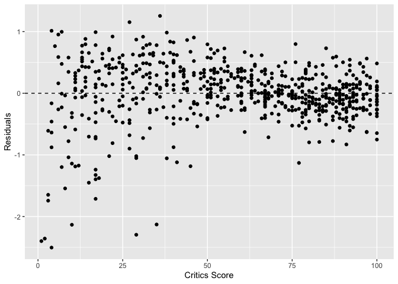<!-- -->

``` r
audience_score_residual <- data.frame(residuals = final_model$residuals, audience_score = movies_t0$audience_score)
ggplot(data = audience_score_residual, aes(x = audience_score, y = residuals)) +
  geom_point() +
  geom_hline(yintercept = 0, linetype = 'dashed') +
  labs(x = 'Audience Score', y = 'Residuals')
```

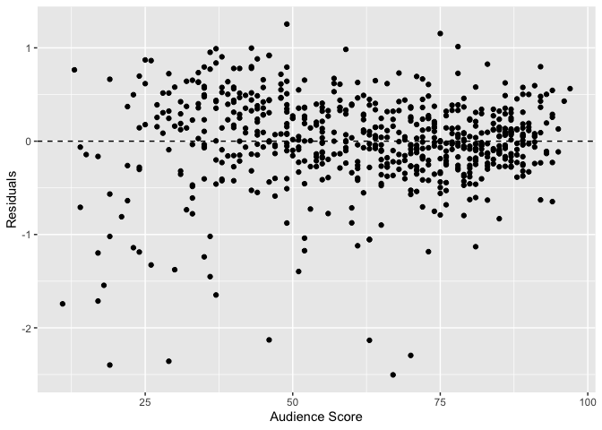<!-- -->

It is possible to verify that the residuals for both variables are
distributed randomly scattered around 0, which means that the conditions
are met. <br/><br/>

#### Nearly normal residuals

Using a histogram and a normal probability plot is possible to check if
the residuals are nearly normally distributed.

``` r
par(mfrow=c(1,2))
hist(final_model$residuals, main = 'Histogram of Residuals')
qqnorm(final_model$residuals, main = 'Normal Probability Plot of Residuals')
qqline(final_model$residuals)
```

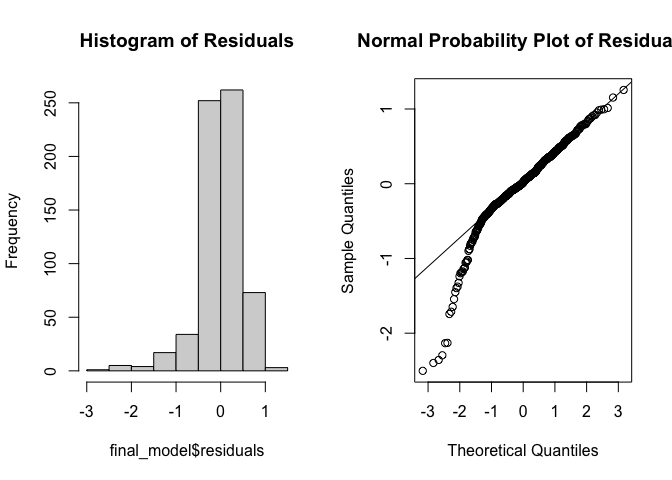<!-- -->

The plot is left-skewed but not strong and the normal probability plot
has deviation only on the left tail. It is right to assume that the
residuals have a nearly normal distribution and this condition is
satisfied <br/><br/>

#### Constant variability of residuals

The residuals should be equally variable for low and high values of the
predicted response variable. To check this condition it uses a residuals
plot of residuals vs. predicted.

``` r
graphs <- c()

fitted_residual <- data.frame(residuals = final_model$residuals, fitted = final_model$fitted)
graphs[[1]] <- ggplot(data = fitted_residual, aes(x = fitted, y = residuals)) +
  geom_point() +
  geom_hline(yintercept = 0, linetype = 'dashed') +
  labs(title = 'Residuals vs. fitted', x = 'Fitted', y = 'Residuals') +
  theme(plot.title = element_text(hjust = 0.5))

graphs[[2]] <- ggplot(data = fitted_residual, aes(x = fitted, y = abs(residuals))) +
  geom_point() +
  geom_hline(yintercept = 0, linetype = 'dashed') +
  labs(title = 'Absolute values of residuals vs. fitted', x = 'Fitted', y = 'Residuals') +
  theme(plot.title = element_text(hjust = 0.5))

grid.arrange(grobs = graphs,
            ncol = 2, nrow = 1)
```

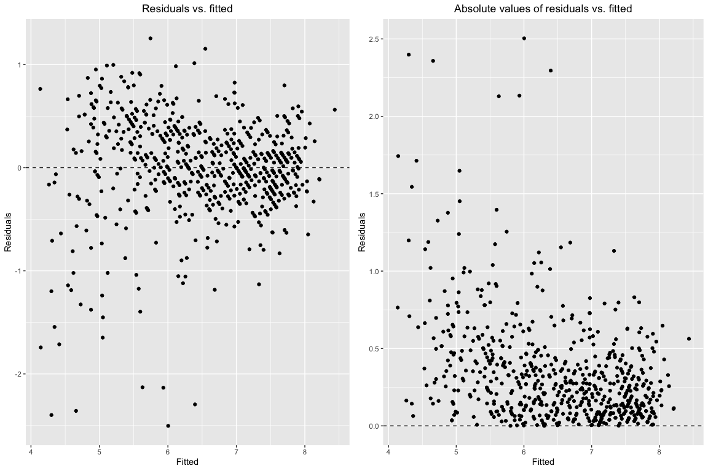<!-- -->

The first plot is the `Residuals vs. fitted` and it does not have a fan
shape and the variability of the residuals are nearly constant since the
distribution is left-skewed. The second plot `Absolute values of
residuals vs. fitted` confirms the nearly constant variability and this
condition has been satisfied too. <br/><br/>

#### Independent residuals

The residuals should not show any pattern when increasing or decreasing.
To that, we plot the residuals in the normal order.

``` r
order_residual <- data.frame(residuals = final_model$residuals, index = seq(1:length(final_model$residuals)))
ggplot(data = order_residual, aes(x = index, y = residuals)) +
  geom_point() +
  geom_hline(yintercept = 0, linetype = 'dashed') +
  labs(title = 'Order Residuals', x = 'Index', y = 'Residuals') +
  theme(plot.title = element_text(hjust = 0.5))
```

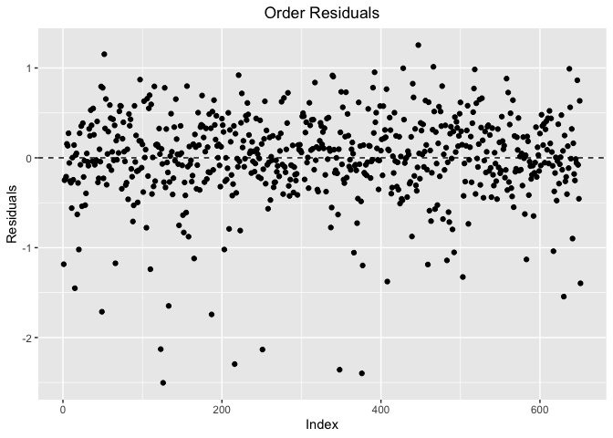<!-- -->

Considering it is an observational study where the data was randomly
collected, and examining the plot above without any pattern is possible
to consider the condition was met. <br/><br/>

-----

## Part 5: Prediction

Using the model created above in this step we will predict an `IMDB
rating` for a movie that does not exist in the current data set. The
movie is called `Harriet` from 2019 and has a rate of `6.6` on the IMDB
website. The data about this movie come from IMDB and Rotten Tomatoes
website.

``` r
harriet <- data.frame(critics_score = 73, audience_score = 97, best_pic_win = 0, best_actor_win = 0, best_actress_win = 0, best_dir_win = 0)
predict(final_model, harriet, interval = 'prediction', level = 0.95) %>% 
  kbl() %>% kable_styling(bootstrap_options = c("striped", "hover", "condensed"))
```

<table class="table table-striped table-hover table-condensed" style="margin-left: auto; margin-right: auto;">

<thead>

<tr>

<th style="text-align:right;">

fit

</th>

<th style="text-align:right;">

lwr

</th>

<th style="text-align:right;">

upr

</th>

</tr>

</thead>

<tbody>

<tr>

<td style="text-align:right;">

7.841455

</td>

<td style="text-align:right;">

6.879956

</td>

<td style="text-align:right;">

8.802954

</td>

</tr>

</tbody>

</table>

The `IMDB rating` predict is `7.841455`, which is not accurate, given
that the real rate is 6.6. The prediction with 95% of confidence for
`IMDB rating` was between `6.879956` to `8.802954` what is not precise
to the real rate too. <br/><br/>

Maybe `Harriet` for being a more modern movie (from 2019) is not a good
movie to be predicted because the current data set is the movies
released before 2016. The question is if the movie is from 2016 the
prediction could be more accurate. For the new prediction, it will use
the movie `The Magnificent Seven` from 2016 which has a `6.9` rate in
the IMDB website. The data about this movie come from IMDB and Rotten
Tomatoes website.

``` r
the_magnificent_seven <- data.frame(critics_score = 64, audience_score = 72, best_pic_win = 0, best_actor_win = 1, best_actress_win = 0, best_dir_win = 0)
predict(final_model, the_magnificent_seven, interval = 'prediction', level = 0.95) %>% 
  kbl() %>% kable_styling(bootstrap_options = c("striped", "hover", "condensed"))
```

<table class="table table-striped table-hover table-condensed" style="margin-left: auto; margin-right: auto;">

<thead>

<tr>

<th style="text-align:right;">

fit

</th>

<th style="text-align:right;">

lwr

</th>

<th style="text-align:right;">

upr

</th>

</tr>

</thead>

<tbody>

<tr>

<td style="text-align:right;">

6.96768

</td>

<td style="text-align:right;">

6.004102

</td>

<td style="text-align:right;">

7.931257

</td>

</tr>

</tbody>

</table>

The `IMDB rating` predict is `6.96768`, which is very accurate to the
real rate is 6.9. The prediction with 95% of confidence for `IMDB
rating` was between `6.004102` to `7.931257` what is precise to the real
rate too. <br/>

Maybe to predict a more modern movie with more accuracy the model needs
a more updated data set. It is possible that the rating approach change
in the last years. <br/>

-----

## Part 6: Conclusion

The conclusion for this study was that `runtime` is not a strong
explanatory variable to `IMDB rating`. On the other hand, the `Rotten
Tomatoes'` score and have actors/actresses, a director that won an
Oscar, or won an Oscar for the best picture is a good explanation to
`IMDB rating`.

Maybe the current data set should be updated with more modern movies to
have more accuracy in predict modern movies. <br/><br/>
